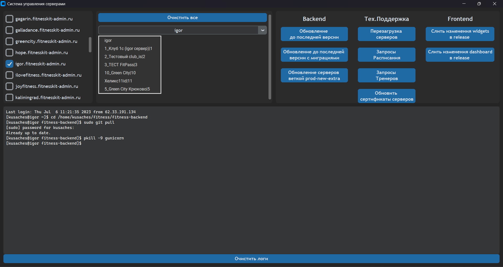
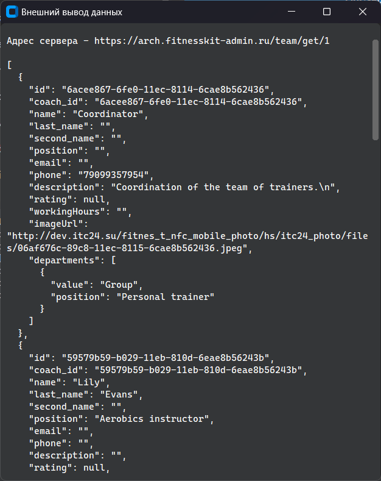

**Десктопный менеджер для серверов** - функциональный менеджер для работы с серверами

**Функции**:

* Выборка по всем серверам и клубам этих серверов
* 3 секции кнопок для *Backend*, *Тех.Поддержка*, *Frontend* 
* Встроенная консоль вывода результата выполнения команды

**Особенности**:

* Для успешной работы потребуются два файла - *servers.txt* и *clubs.txt*(Опционально, можно оставить пустым)
* Внедрена строгая типизация и ООП методология при написании кода
  




## Установка:

### Клонирование менеджера:

```console
$ git clone https://github.com/JackOman69/desktop-manager
```

### Установка библиотек и зависимостей:

```console
$ python3 -m venv venv

$ source ./venv/bin/activate  (Если Linux или Macos)
$ ./venv/Scripts/activate  (Если Windows)

$ pip3 install -r requirements.txt
``` 

### Запуск менеджера:

```console
$ python3 main.py
```
